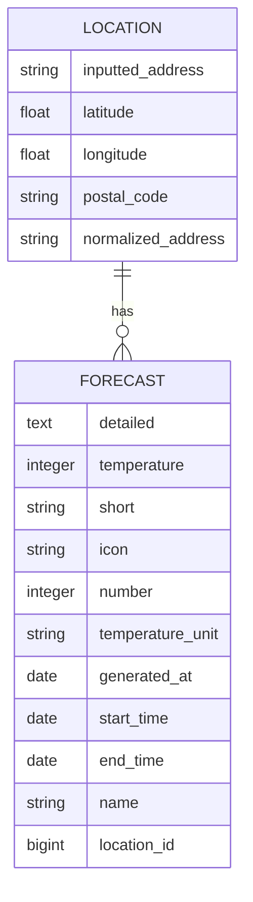

# Weather Forecast

This Ruby on Rails application retrieves forecast data for a provided address. Forecast data provided by the [National Weather Service API](https://www.weather.gov/documentation/services-web-api).

## Setup

Ensure the following are installed on your system:
- Ruby 3.2.2
- PostgreSQL 16.0

Install dependencies with `bundle install`.

Prepare the database with `bundle exec rails db:prepare`.

Start the server with `bundle exec rails server`.

## Tests

Run the full test suite with `bundle exec rspec spec`.

Please note that external HTTP requests are stubbed.

## Schema

The application uses the following table structure:

